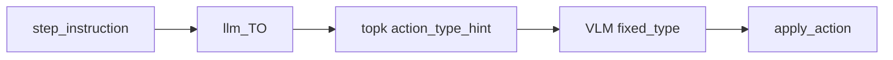

# test3.1.0-SMB 工程化

SMAN-Bench **Single-path** 离线推理与评测。每步沿 GT 路径推进，对比 VLM 预测与 GT 的 **Type / Action / TopK Retrieval**。

数据只读 [Mobile3M](../../datasets/Mobile3M/datasets/)，产物写入本目录 `cache/`、`results/`、`checkpoints/`。官方 SMAN 工具在 `SMAN-Bench/`（只读引用）。

- 数据来源：https://huggingface.co/datasets/xwk123/Mobile3M/tree/main

---

## 目录结构

```
test3.1.0-SMB工程化/
├── main.py                 # 推理入口
├── eval.py                 # 评测入口（多 agent 对比表）
├── config.yaml
├── llm_set/llm.py          # LLM / VLM / embedding 配置
├── agents/
│   ├── m2_agent.py         # M2：llm_TO → TopK → VLM（固定 type）
│   ├── TO_agent.py         # TO：Top-1 检索 + VLM 填字段
│   ├── AppAgent.py         # 官方 AppAgent single-path 适配
│   ├── appagent_parse.py   # AppAgent Observation/Action 解析
│   ├── to_click.py         # TO click 后处理（force_top1）
│   ├── to_scroll.py        # TO scroll 后处理（direction + top1）
│   ├── parser.py           # VLM JSON → click(N) / scroll(N, dir)
│   ├── prompts.py          # 英文 VLM 提示词（m2）；中文（TO）
│   └── vlm_client.py
├── annotate/
│   ├── llm_TO.py           # step_instruction → action_type + target_object
│   ├── topk.py             # embedding TopK + 标注管线（节点 label 为数字 N，图上显示 #N）
│   ├── embedder.py         # qwen3-vl-embedding
│   ├── annotate.py         # 画框与 #N 标签（P1–P3）
│   ├── node_dedupe.py      # TopK 前：同 bounds 去重
│   └── node_filter.py      # TopK 后：嵌套 scroll 抑制等
├── utils/
│   ├── sman_bridge.py      # prepare_round_assets / apply_action
│   ├── click_geom.py       # 归一化坐标 → bbox 命中判定
│   ├── click_res.py        # click xy 动作格式工具
│   ├── action_id_resolve.py
│   ├── step_log.py         # 终端 Step 日志、TYPE 过滤、评测对齐
│   ├── task_context.py
│   └── result_io.py        # 按 GT 类型分目录写结果
├── cache/
│   ├── labeled/top_{K}/{task_name}/{page}.png
│   ├── nodes/top_{K}/{task_name}/{page}.json
│   ├── retrieval/top_{K}/{task_name}/{page}/{to_digest}.json
│   └── embeddings/{task_name}/{page}/
├── results/{task_type}_{agent}_{model}/
│   ├── click/{task_index}_{final_page_name}.json
│   ├── scroll/...
│   └── input/...
├── checkpoints/            # eval 指标 JSON
└── SMAN-Bench/             # 官方 utils（action_click / gt_action_ids 等）
```

---

## 环境

```bash
cd GUI_agent/test3.1.0-SMB工程化
pip install opencv-python pillow langchain-openai python-dotenv httpx numpy pyyaml colorama
```

在 `.env` 或上级 `GUI_agent/.env` 配置 API Key（见 `llm_set/llm.py`）：

| 用途 | 变量 / 模型 |
|------|-------------|
| VLM | `QWEN_API_KEY`，默认 `qwen-vl-max` |
| llm_TO | `llm`（默认 DeepSeek 文本模型） |
| TopK embedding | `vlm_embedding`（`qwen3-vl-embedding`） |

切换 VLM：修改 `llm_set/llm.py` 中 `vlm = ...`。

---

## Mobile3M 前置

图目录需已生成 SMAN 索引（`all_action_id.json`、`all_page_actions.json` 等）：

```bash
cd datasets/Mobile3M
python3 convert_mobile3m.py datasets/QQmusic_graph_8152 --mode explore
```

---

## Agent 与 TOP_K

| Agent | 说明 |
|-------|------|
| `m2` | llm_TO 固定 type → 条件 **Top-K** 检索 → 截图标签 **#1、#2、#3…** → VLM 填 element/direction/text |
| `to` | 同流水线；需检索的 type 用 **Top-1**；click/scroll 由系统注入 top1，VLM 仅输出 thought 或 direction |
| `AppAgent` | 官方 **single-path** baseline：全页 SoM（`draw_bbox_multi`，仍含 c/s 前缀）+ 英文 prompt |

### llm_TO 与检索 K

`annotate/llm_TO.py` 的 `generate_target_object` 输出本步 **action_type**（click/scroll/input/back/long_press）与 **target_object**。检索 Top-K 由 type 决定：m2 用 `TOP_K`；TO 对 click/scroll 用 **1**。



步骤日志字段：`llm_action_type`、`llm_to_raw`、`llm_routing_fallback`（无 `instruction_hit` 关键词路由）。

| Agent | llm_action_type | 检索 K | 标注 | VLM |
|-------|-----------------|--------|------|-----|
| **m2** | llm_TO | `TOP_K` | Top-K **#N** 标签 | 固定 type，填 element/direction/text |
| **to** | llm_TO | click/scroll **1**，其余 — | Top-1 **#N** 或原图 | TO prompt + force_top1 |

- 检索节点 `label` 为纯数字 **N**；`annotate.py` 绘制为 **#N**（对齐 4.1.0 视觉）。`parser` 接受 `#N` 或 `N`，仍兼容 legacy `c1`/`s1`。
- `TOP_K` 在 `main.py` 传入 agent；m2 全路径使用；TO 对需检索的 type 覆盖为 1。
- 每步实际检索 K 写入 `assets.retrieval_top_k` 与结果 JSON 的 `top_k` 字段。

### VLM 提示词（`agents/prompts.py`）

VLM 调用采用 **SystemMessage + HumanMessage** 拆分（对齐 4.1.0）：System 含 Role / Task / Fixed / Screen / Schema / Rules；User 含当前步骤指令、检索目标、hints 与截图。JSON 输出 schema 不变。

按 **llm_action_type** 路由；**m2 为英文**，**TO 仍为中文**：

| 场景 | 标注图 | 入口函数 | 要点 |
|------|--------|----------|------|
| click / long_press | Top-K **#N** | `build_m2_prompt_parts` / `build_to_prompt_parts` | 固定 type；m2 输出 `element`（`#N` 或 N）；TO click 仅 thought |
| scroll | Top-K **#N** | 同上 | m2：**element + direction**（finger-gesture 规则）；TO 仅 direction |
| input | 无标注原图 | 同上 | 仅 text |

`AppAgent` 仍使用单条 `call_vlm(prompt, image)`，未拆分。

m2 scroll 方向规则与 4.1.0 一致（手指滑动方向 ≠ 内容移动方向）；scroll 仍要求 VLM 从 Top-K 候选中选区域 **#N**（与 4.1.0 仅输出 direction 不同）。

---

## 推理配置（`main.py` 顶部）

| 变量 | 说明 | 示例 |
|------|------|------|
| `AGENT` | `m2` / `to` / `AppAgent` | `to` |
| `TASK_JSON` | 任务列表 | `simple_tasks_sample.json` |
| `TASK_TYPE` | 结果目录前缀 | `single_simple` |
| `TEST_START` / `TEST_END` | 任务切片 `[START, END)`，`END=-1` 到末尾 | `0` / `100` |
| `APP_NAMES` | 按任务名前缀过滤 | `["QQmusic"]` |
| `TOP_K` | m2 全路径；TO 对 click/scroll 为 1 | `5` |
| `DATA_DIR` | Mobile3M datasets 路径 | `../../datasets/Mobile3M/datasets` |
| `DRY_RUN` | `True` 不调 VLM，用 mock 动作 | `False` |
| `REQUEST_INTERVAL` | 步间休眠秒数 | `0` |
| `TYPE` | 仅推理 GT 类型在此列表中的步；其余步 **SKIP**（`is_skip=true`，仍沿 GT 推进） | `["click"]` / `["scroll"]` / `["click","scroll"]` |

结果根目录：`results/{TASK_TYPE}_{AGENT}_{model_slug}/`  
按本任务实际出现的 GT 类型写入子目录：`click/`、`scroll/`、`input/` 等。  
单任务文件：`{task_index}_{final_page_name}.json`

---

## 运行推理

```bash
python main.py
```

试跑（无 API）：`main.py` 中设 `DRY_RUN = True`、`TEST_END = 1`。

---

## 单步流水线

### 标注路由（`annotate/topk.py`）

由 **llm_TO 的 action_type**（`action_type_hint`）选择 click 池或 scroll 池；检索结果在图上显示为 **#N**。

| llm_action_type | 候选 / 检索 | 标注方式 |
|-----------------|-------------|----------|
| `scroll` | scroll 池 → embedding Top-K | 蓝虚线 + **#N** 标签 |
| `click` / `long_press` | click 池 → embedding Top-K | 红实线 + **#N** 标签 |
| `input` / `back` | 无候选 | 原图，不画标 |

### M2 / TO 流水线

```
分步 instruction
    → llm_TO：action_type + target_object
    → embedding Top-K（TO 对 click/scroll 为 Top-1）
    → 画标注图（**#N** 标签）
    → VLM（固定 type，填 element/direction/text）
    → apply_action（标签数字 → 全局 action_id）
    → 与 GT 对比；页面沿 GT 路径强制推进
```

### AppAgent（官方 single-path baseline）

```
分步 instruction + 整体 task_desc
    → 全页官方 SoM（draw_bbox_multi：cN + sN，1080×2400）
    → 英文 singlepath_task_template
    → VLM → parse_explore_rsp → apply_action
```

要点：

- **页面推进**：无论预测对错，每步结束后跳到 GT 路径的下一页。
- **VLM 动作空间**：`click` / `scroll` / `input`；TO scroll 由系统注入 top1 区域编号，VLM 输出 `direction`。
- **parse 重试**：解析失败最多重试 2 次。
- **GT 显示**：`utils/action_id_resolve.py` 将 `action_id` 反解为 `click(N, 文本)` / `scroll(N, dir)`。

---

## 终端 Step 日志

```
Step 2/4 | QQmusic0_3 | "在听书页面，向下滚动…"
  TO="听书" | Top_5_Retrieval=true
  GT=scroll(13, up) | pred=scroll(25, down) | Type=true | Action=false
```

| 字段 | 含义 |
|------|------|
| `TO` | llm_TO 生成的 `target_object`（click/ambiguous/scroll 步） |
| `Top_K_Retrieval` | GT 区域编号 **N** 是否在当步 TopK 标注子集中（K 为当步实际 `retrieval_top_k`） |
| `Type` | 预测动作类型与 GT 一致 |
| `Action` | `pred_action_id == gt_action_id` |

**click 补充**：同一页上不同 **#N** 可能对应同一 **action_id**（候选池里重复/多条目指向同一控件）。`action_acc` 按 id 比对；`Mean_Retrieval` 按 GT 反查的区域编号是否在 Top-K 标注子集里比对，故偶发 **action 对、retrieval 错**（TO 强制 top1 时更明显）。

---

## 标注与节点过滤

### 两套标注视觉（与 prompt 对应）

| 样式 | 用于 | 实现 |
|------|------|------|
| **工程化 Top-K** | click / scroll 的 Top-K 子集 | `annotate/annotate.py`：click 红实线+浅填色，scroll 蓝虚线无填色，标签 **#N** |
| **官方全页 SoM** | AppAgent baseline | `draw_bbox_multi`：仍用 cN + sN |

### 过滤规则

| 阶段 | 规则 |
|------|------|
| **TopK 前** `dedupe_nodes_by_bounds` | 相同 `(kind, bounds)` 只保留第一个 |
| **TopK 后** `filter_nodes_for_annotation` | 嵌套 scroll：大框包含小框且面积比 ≥10 时删大框；极小 click 仅改标签位置 |

标注图与 `cache/nodes/` 使用**过滤后**的展示子集；GT 反查使用**全页** `scroll_action_bounds`（二者可能不一致，导致 `Top_K_Retrieval=false` 但 GT 仍能显示区域编号）。

---

## 评测配置（`eval.py` 顶部）

| 变量 | 说明 |
|------|------|
| `TASK_TYPE` | 与 `main.py` 一致 |
| `MODEL` | VLM 模型名（`model_slug`，用于扫描 `results/{TASK_TYPE}_*_{MODEL}/`） |
| `DATA_DIR` | Mobile3M 路径 |
| `TYPE` | 评测范围（见下表） |
| `RESULT_DIR` | 可选，直接指定某一 agent 的结果目录 |

`eval.py` **不再绑定单个 AGENT**：对同一 `MODEL` 下已推理的 `m2` / `to` 结果目录自动扫描，终端打印**对比表**。

### `TYPE` 评测模式

| `TYPE` | 行为 |
|--------|------|
| `["click"]` | 只评 `results/.../click/` 下任务；计分步仅含 GT 为 click 的步 |
| `["scroll"]` | 只评 `scroll/` 子目录 |
| `["click", "scroll"]` | **分目录各算一行**（不合并 SR） |
| `["all"]` | 合并各类型子目录，按**整条任务**算统一 SR；缺步任务跳过且不计分母（`incomplete_task_count`） |

须与推理时的 `TASK_TYPE`、`MODEL`（及 `TYPE` 子目录布局）一致。

---

## 运行评测

```bash
python eval.py
```

指标（逐步对齐 GT `action_id`）：

| 指标 | 含义 |
|------|------|
| `success_rate` | 任务内参与计分步全部 `pred_id == gt_id` 的任务占比 |
| `action_acc` | 全局步级 action_id 准确率 |
| `type_acc` | 全局步级动作类型准确率 |
| `Mean_Retrieval` | GT 区域编号落在当步 TopK 标注子集的比例 |
终端对比表与 `checkpoints/eval_{TASK_TYPE}_{MODEL}_agents_{timestamp}.json` 均带 `( 命中 / 总数 )`。

---

## 原始 GT 动作格式（Mobile3M）

数据集**不存** `cN/sN`，存全局动作字符串：

| 类型 | 格式示例 |
|------|----------|
| click | `click(<p id="..." clickable="true"> 听书 </p>)` |
| scroll | `scroll(([360, 817], [360, 429]))` |
| input | `input(<input ... EditText>, '文本')` |

`cN/sN`（AppAgent 官方）或数字 **N** / **#N**（工程化检索）由当页候选列表 + `action_id` 反查得到。详见 `SMAN-Bench/接口.md`。

---

## 注意事项

- 在工程根目录运行 `main.py` / `eval.py`。
- 不向 Mobile3M 写入推理产物。
- 修改 `TOP_K`、标注或 filter 后，删除对应 `cache/labeled/`、`cache/nodes/`、`cache/retrieval/` 再重跑。
- 本工程为 **single-path**，支持 **m2 / to / AppAgent**；Multi-path、reflection、旧版 m123/baseline 已移除。
