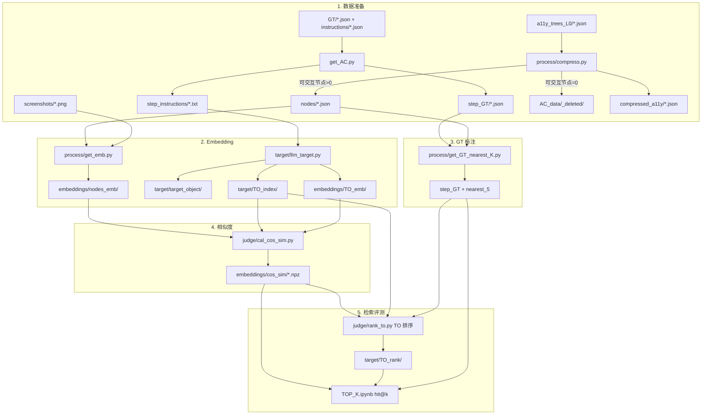
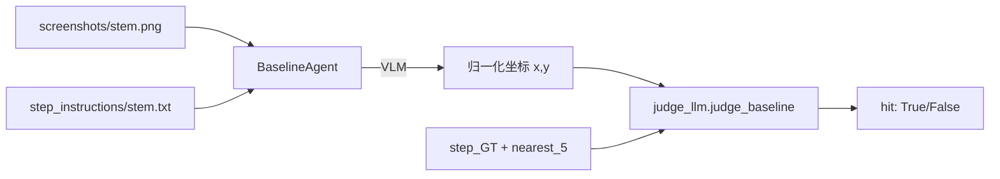
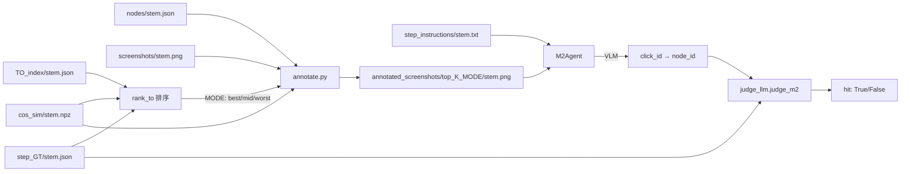

# test4.0.0-AC_TO

基于 Android Control（AC）数据的 **Target Object（TO）embedding 检索 + VLM Agent 评测** 流水线：

1. 用 LLM 生成目标元素描述，与 UI 节点 embedding 做余弦相似度匹配（检索评测）
2. 用 **Baseline / M2** 两个 VLM Agent 在截图上决策，并用 `judge_llm` 判定是否命中 GT

## 目录结构

```
test4.0.0-AC_TO/
├── get_AC.py                 # 数据预处理：拆分 GT/instructions，筛选 click 四件套
├── main.py                   # Agent 评测入口（baseline / m2）
├── TOP_K.ipynb               # 单 TO 检索 hit@k 可视化（best / mid / worst）
├── 对比.ipynb                 # 按 Model 对比各 Agent 命中率
├── AC_data/                  # 样本与 embedding 数据（见 AC_data/README.md）
├── agents/
│   ├── baseline_agent.py     # 原始截图 + 指令 → 归一化坐标
│   ├── m2_agent.py           # 标注截图 + 指令 → click_id (node_id)
│   ├── prompts.py            # 各 Agent prompt
│   └── annotate/
│       ├── annotate.py       # 单 TO 相似度 top_k → 标注截图
│       ├── annotate_utils.py # 绘制 bbox 与 #node_id（容器框不填充，避免遮挡）
│       └── annotated_screenshots/top_{K}_{MODE}/  # 标注图输出（MODE=best/mid/worst）
├── process/
│   ├── compress.py           # a11y 压缩 → nodes（0 节点样本移入 _deleted）
│   ├── stem_deleted.py       # 四件套归档与衍生产物清理
│   ├── get_emb.py            # 节点 multimodal embedding
│   └── get_GT_nearest_K.py   # 为 step_GT 写入 nearest_5
├── target/
│   ├── llm_target.py         # LLM 生成 TO + TO_index + TO_emb
│   ├── target_object/
│   ├── TO_index/
│   └── TO_rank/              # rank_to 输出的每页 TO 排行榜
├── judge/
│   ├── cal_cos_sim.py        # nodes_emb × TO_emb → cos_sim
│   ├── rank_to.py            # 每页 TO 独立检索排序
│   ├── judge.py              # 通用 top_k 检索工具（供 notebook 等调用）
│   ├── hit_1.py              # top_1 几何 EM（坐标判定）
│   └── judge_llm.py          # Agent 判定（baseline / m2）
├── runs/                     # Agent 评测结果 JSON
└── llm_set/
    └── llm.py                # VLM / target LLM / embedding 配置
```

## 完整数据流向（检索流水线）

所有单步样本以 **stem** 命名：`{episode_id}_{step_id:03d}`，例如 `00000020_001`。



### 推荐执行顺序（检索）

在项目根目录 `test4.0.0-AC_TO/` 下：

```bash
# 1. 拆分 GT / instructions，筛选 click 四件套
python get_AC.py

# 2. a11y → nodes（0 可交互节点样本自动移入 _deleted）
python process/compress.py

# 3. 节点 embedding
python process/get_emb.py

# 4. LLM 生成 TO + TO embedding
python target/llm_target.py

# 5. GT 最近 5 个候选框
python process/get_GT_nearest_K.py

# 6. 余弦相似度矩阵
python judge/cal_cos_sim.py

# 7. TO 排序（每页所有 TO 优劣榜）
python judge/rank_to.py

# 8. 检索 hit@k 可视化（best / mid / worst 单 TO）
# 打开 TOP_K.ipynb
```

---

## Agent 评测（Baseline / M2）

在检索流水线跑通（至少完成 `compress` → `get_emb` → `llm_target` → `get_GT_nearest_K` → `cal_cos_sim`）之后，可用 `main.py` 评测 VLM Agent。

### 配置（`main.py` 顶部）

```python
AGENT = "baseline"   # 或 "m2"
TOP_K = 10           # 仅 m2：cos_sim 检索候选数
MODE = "best"        # 仅 m2：best | mid | worst（rank_to 选取 TO 后取 top_k）
TEST_START = 0
TEST_END = 100
```

```bash
python main.py
```

结果写入 `runs/`：

| Agent | 文件名 |
|-------|--------|
| baseline | `runs/baseline_{model}.json` |
| m2 | `runs/m2_top{TOP_K}_{MODE}_{model}.json` |

对比各模型 / 各 Agent 命中率：打开根目录 `对比.ipynb`。

### Baseline Agent 数据流



| 步骤 | 说明 |
|------|------|
| 输入 | 原始截图 + 单步自然语言指令 |
| 输出 | `{"x": 0.0~1.0, "y": 0.0~1.0}` 归一化点击坐标 |
| 判定 | `judge_baseline`：反归一化到像素坐标后，满足其一即 hit |
| | 1. 像素坐标落在 `nearest_5` 任一 bbox 内 |
| | 2. 与 GT `(x,y)` 归一化欧氏距离 < `0.04` |

与 `hit_1.py` 的几何 EM 思路一致，但坐标来自 **VLM 直接预测**，而非 embedding 检索。

### M2 Agent 数据流



| 步骤 | 说明 |
|------|------|
| 标注 | 按 `rank_to` 选取 TO（`MODE=best/mid/worst`），用该 TO 的相似度列取 top `TOP_K` 个 node，在截图上绘制 bbox 与 `#node_id` |
| 输入 | 标注截图 + 单步指令（无额外文本 context） |
| 输出 | `{"click_id": int}`，即预测的 `node_id` |
| 判定 | `judge_m2`：预测的 `node_id` 是否在 `step_GT.nearest_5` 的 `node_id` 集合中（同检索 **judge hit@1**） |

单独生成标注图：

```bash
python agents/annotate/annotate.py --top-k 10 --mode best
```

### 评测逻辑对照

| 评测对象 | 模块 | 预测来源 | 命中标准 |
|----------|------|----------|----------|
| 单 TO 检索 top_k | `TOP_K.ipynb` / `annotate.py` | 选定 TO 的 cos_sim 列 → top_k node_id | 与 `nearest_5` 的 node_id 有交集 |
| TO 排序 | `judge/rank_to.py` | 每条 TO 单独 top-1 检索 | 按 hit / pred_score / margin 排序 |
| **Baseline Agent** | `judge/judge_llm.py` | VLM 归一化坐标 | 几何 EM（bbox 或距离 < 0.04） |
| **M2 Agent** | `judge/judge_llm.py` | VLM 选择的 node_id | node_id ∈ `nearest_5`（hit@1） |

---

## TO 排序与选取

核心思路：**不再对每个 node 聚合所有 TO**，而是先给每条 TO 单独做检索排序，再按策略选取一条 TO，用其相似度列与所有节点匹配。

### 1. TO 排序（`rank_to.py`）

对每个界面的**所有 TO** 各做一次 top-1 检索，按表现排出优劣榜。

```bash
python judge/rank_to.py                          # 全量，写入 target/TO_rank/
python judge/rank_to.py --stem 00000100_001      # 单样本
python judge/rank_to.py --start 0 --end 100      # 切片
```

| 输出 | 说明 |
|------|------|
| `target/TO_rank/{stem}.json` | 该界面 TO 全序排行榜 |
| `target/TO_rank/summary.json` | 批量汇总指标 |

**每条 TO 先算 4 个指标：**

| 指标 | 含义 |
|------|------|
| `hit` | 该 TO top-1 节点是否在 `nearest_5` 内 |
| `pred_score` | 该 TO 与所有节点的最高相似度 |
| `margin` | 最高分 − 第二高分 |
| `gt_max_sim` | 该 TO 在 `nearest_5` 节点上的最高相似度 |

**排序规则：** `hit` 优先 → `pred_score` → `margin`；miss 组按 `gt_max_sim` → `pred_score`。

**汇总指标：**

| 指标 | 含义 |
|------|------|
| `oracle_hit_rate` | 至少有一个 TO 命中的样本占比 |
| `rank1_hit_rate` | 排名第 1 的 TO 命中的样本占比 |
| `mrr` | 第一个 hit TO 的 reciprocal rank 均值 |
| `avg_hit_tos` | 每样本 hit TO 数量的均值 |

### 2. TO 选取策略（`MODE`）

从 `rank_to` 排行榜中选取一条 TO，用于检索 top_k 节点或 M2 标注：

| MODE | 含义 |
|------|------|
| `best` | 排名第 **1** 的 TO（单独检索表现最好） |
| `mid` | 排名**中位数**的 TO |
| `worst` | 排名**倒数第 1** 的 TO |

选定 TO 后，用其在 `cos_sim` 矩阵中的**单列**与所有节点算相似度，取 top_k 个 node。

用于：`annotate.py`（M2 标注）、`TOP_K.ipynb`（hit@k 曲线）、`main.py`（`MODE` 配置项）。

### 3. 检索 hit@k 判定

- **输入**：选定的 TO、`top_k`
- **过程**：该 TO 相似度列降序取 top_k 个 `node_id`
- **命中**：预测 node_id 集合与 `nearest_5` 的 node_id **存在交集**

`TOP_K.ipynb` 横轴为 `top_k = 1..20`，三条曲线分别为 `best` / `mid` / `worst`。

### 4. M2 Agent hit 判定

- **输入**：Agent 输出的 `click_id`（node_id）
- **命中**：`click_id ∈ step_GT.nearest_5`（node_id 匹配，非几何判定）

## 依赖

- `llm_set/llm.py`：`vlm`（Agent）、`vlm_embedding`（节点/TO embedding）、`llm_target*`（TO 生成）
- `.env`：`QWEN_API_KEY` 等

## 参考

- GT 最近 5 框对齐 [AgentCPM-GUI evaluator](https://github.com/OpenBMB/AgentCPM-GUI/blob/main/eval/utils/evaluator.py)
- 数据格式与 `_deleted` 规则见 [AC_data/README.md](AC_data/README.md)
