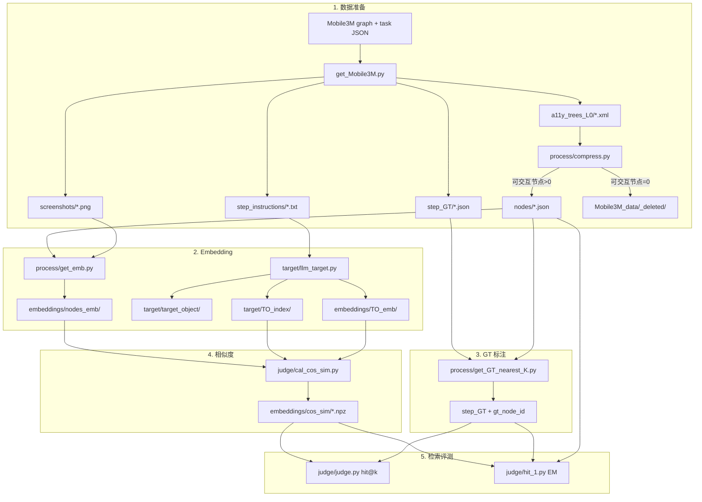

# test4.0.1-SMB_TO

基于 **Mobile3M** 数据的 **Target Object（TO）embedding 检索 + VLM Agent 评测** 流水线：

1. 用 LLM 生成目标元素描述，与 UI 节点 embedding 做余弦相似度匹配（检索评测）
2. 用 **Baseline / M2** 两个 VLM Agent 在截图上决策，并用 `judge_llm` 判定是否命中 GT

## 目录结构

```
test4.0.1-SMB_TO
├── get_Mobile3M.py           # Mobile3M → Mobile3M_data 四件套
├── config/data_paths.py      # BASE_DIR → Mobile3M_data
├── main.py                   # Agent 评测入口（baseline / m2）
├── TOP_K.ipynb               # 检索评测可视化
├── 对比.ipynb                 # 按 Model 对比各 Agent 命中率
├── Mobile3M_data/            # 样本数据（四件套 + embeddings）
├── utils/                    # mobile3m_io / mobile3m_gt / gt_node_match / xml_to_ager
├── agents/
│   ├── baseline_agent.py     # 原始截图 + 指令 → 归一化坐标
│   ├── m2_agent.py           # 标注截图 + 指令 → click_id (node_id)
│   ├── prompts.py            # 各 Agent prompt
│   └── annotate/
│       ├── annotate.py       # cos_sim top_k → 标注截图
│       └── annotated_screenshots/top_{K}_{MODE}/
├── process/
│   ├── compress.py           # a11y 压缩 → nodes（0 节点样本移入 _deleted）
│   ├── stem_deleted.py       # 四件套归档与衍生产物清理
│   ├── get_emb.py            # 节点 multimodal embedding
│   └── get_GT_nearest_K.py   # gt_action → gt_node_id
├── target/
│   ├── llm_target.py         # LLM 生成 TO + TO_index + TO_emb
│   ├── target_object/
│   └── TO_index/
├── judge/
│   ├── cal_cos_sim.py        # nodes_emb × TO_emb → cos_sim
│   ├── judge.py              # 检索 hit@k（node_id 判定）
│   ├── hit_1.py              # 检索 top_1 EM（几何判定）
│   ├── judge_llm.py          # LLM Agent 判定（baseline / m2）
│   └── rank_to.py            # TO 排序与 oracle 指标
├── runs/                     # Agent 评测结果 JSON
└── llm_set/
    └── llm.py                # VLM / target LLM / embedding 配置
```

## 完整数据流向

所有单步样本以 **stem** 命名：`{task_name}_{step_id:03d}`，例如 `QQmusic0_34_347_000`。



### 推荐执行顺序

在项目根目录 `test4.0.1-SMB_query_emb/` 下：

**前置**（对每个 App graph，只需一次）：

```bash
cd datasets/Mobile3M
python3 convert_mobile3m.py datasets/QQmusic_graph_8152 --mode explore
```

**完整流水线**：

```bash
cd GUI_agent/test4.0.1-SMB_query_emb

python get_Mobile3M.py
python process/compress.py
python process/get_emb.py
python target/llm_target.py
python process/get_GT_nearest_K.py
python judge/cal_cos_sim.py

# 检索评测
python judge/judge.py --top-k 1 --mode mid
python judge/hit_1.py --mode mid
python judge/rank_to.py

# Agent 评测
python main.py

# 可视化
# 打开 TOP_K.ipynb、对比.ipynb
```

数据目录说明见 [`Mobile3M_data/README.md`](Mobile3M_data/README.md)。

---

## Agent 评测（Baseline / M2）

在检索流水线跑通（至少完成 `compress` → `get_emb` → `llm_target` → `get_GT_nearest_K` → `cal_cos_sim`）之后，可用 `main.py` 评测 VLM Agent。

### 配置（`main.py` 顶部）

```python
AGENT = "baseline"   # 或 "m2"
TOP_K = 10           # 仅 m2：cos_sim 检索候选数
MODE = "best"        # 仅 m2：best | mid | worst（rank_to 选取 TO 后取 top_k）
TEST_START = 0
TEST_END = 100
```

```bash
python main.py
```

结果写入 `runs/`：

| Agent | 文件名 |
|-------|--------|
| baseline | `runs/baseline_{model}.json` |
| m2 | `runs/m2_top{TOP_K}_{MODE}_{model}.json` |

对比各模型 / 各 Agent 命中率：打开根目录 `对比.ipynb`。

### Baseline Agent

| 步骤 | 说明 |
|------|------|
| 输入 | 原始截图 + 单步自然语言指令 |
| 输出 | `{"x": 0.0~1.0, "y": 0.0~1.0}` 归一化点击坐标 |
| 判定 | 像素坐标落在 GT 框内，或与 GT 中心归一化距离 ≤ **0.14** |

### M2 Agent

| 步骤 | 说明 |
|------|------|
| 标注 | 按 `rank_to` 选取 TO，用该 TO 的相似度列取 top `TOP_K` 个 node，在截图上绘制 bbox 与 `#node_id` |
| 输入 | 标注截图 + 单步指令 |
| 输出 | `{"click_id": int}` |
| 判定 | 预测的 `node_id` 等于 `gt_node_id` |

单独生成标注图：

```bash
python agents/annotate/annotate.py --top-k 10 --mode best
```

### 三种评测逻辑对照

| 评测对象 | 模块 | 预测来源 | 命中标准 |
|----------|------|----------|----------|
| 检索 top_k | `judge/judge.py` | cos_sim 排序的 node_id 集合 | 与 `gt_node_id` 一致 |
| 检索 top_1 几何 | `judge/hit_1.py` | cos_sim top_1 节点中心点 | GT 框内或距 GT 归一化距离 ≤ 0.14 |
| **Baseline Agent** | `judge/judge_llm.py` | VLM 归一化坐标 | GT 框内或距离 ≤ 0.14 |
| **M2 Agent** | `judge/judge_llm.py` | VLM 选择的 node_id | node_id == `gt_node_id` |

---

## TO 选取策略（`MODE`）

通过 `rank_to` 对每个界面的所有 TO 独立检索并排序后，按 `MODE` 选取**单个 TO**，再用该 TO 的相似度列取 top_k 个 node：

| MODE | 含义 |
|------|------|
| `best` | 排名第 **1** 的 TO（单独检索表现最好） |
| `mid` | 排名**中位数**的 TO |
| `worst` | 排名**倒数第 1** 的 TO |

## TO 排序（rank_to）

对每个界面的**所有 TO** 单独做 top-1 检索，按检索是否命中 GT 排序。

```bash
python judge/rank_to.py
python judge/rank_to.py --stem QQmusic0_34_347_000
python judge/rank_to.py --start 0 --end 50
```

| 指标 | 含义 |
|------|------|
| `oracle_hit_rate` | 至少有一个 TO 命中的样本占比 |
| `rank1_hit_rate` | 排名第 1 的 TO 命中的样本占比 |
| `mrr` | 第一个 hit TO 的 reciprocal rank 均值 |

## 依赖

- `llm_set/llm.py`：`vlm`（Agent）、`vlm_embedding`（节点/TO embedding）、`llm_target*`（TO 生成）
- `.env`：`QWEN_API_KEY` 等

## 参考

- GT 对齐 [AgentCPM-GUI evaluator](https://github.com/OpenBMB/AgentCPM-GUI/blob/main/eval/utils/evaluator.py)
