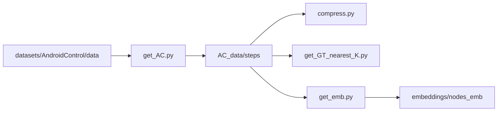

# test4.1.0-AC_high

Android Control（AC）全步轨迹实验：Target Object 检索 + 节点标注 + VLM 预测，支持 **AC-low** / **AC-high**。

- 数据说明：[AC_data/README.md](AC_data/README.md)
- Agent 说明（m2 / m2v / m12 / TO / CPM）：[agents/README.md](agents/README.md)
- **评测机制**（指标、各 Agent 差异、scroll/wait 等特殊规则）：[eval/README.md](eval/README.md)

---

## 目录概览

```
test4.1.0-AC_high/
├── get_AC.py                 # 原始 AC → AC_data 拆分
├── process/                  # 压缩 a11y、nearest_5、节点 embedding
├── annotate/                 # llm_TO、top_k 检索、画标注图
├── agents/                   # VLM Agent（见 agents/README.md）
├── llm_set/llm.py            # llm_target / vlm / vlm_embedding
├── main.py                   # 实验入口
├── eval/                     # step 判定 + 批量评估（见 eval/README.md）
├── runs/                     # 实验结果
├── 对比.ipynb
└── AC_data/
```

---

## 数据流向

### 离线预处理



| 阶段 | 输出 |
|------|------|
| `get_AC.py` | `steps/`、`episodes/`、`manifest.json` |
| `compress.py` | `compressed_a11y`、`nodes.json` |
| `get_GT_nearest_K.py` | GT 追加 `nearest_5` |
| `get_emb.py` | `nodes_emb/*.npy` |

### 在线推理（`main.py`）

每步：`llm_TO（或 m2v 的 target_object）→ top_k 检索 → 标注图 → VLM → 评测`。节点 embedding 读离线文件；TO embedding 在线计算不落盘。

---

## AC-low vs AC-high

| | AC-low | AC-high |
|---|--------|---------|
| VLM 文本 | `goal` + 当前 step `instruction` | 仅 `goal` |
| step0 的 TO 输入 | step0 instruction | episode goal |
| step n+1 的 TO 输入 | 下一步 GT instruction | 上步 VLM 的 `next_instruction`（m2v 可用 VLM 的 `target_object` 跳过 llm_TO，见 agents README） |
| VLM 额外输出 | 无 | `next_instruction`（m2/m2v）；m2v 另有 `target_object` |

---

## 运行

```bash
# 预处理（一次性）
python get_AC.py
python process/compress.py
python process/get_GT_nearest_K.py
python process/get_emb.py

# 实验：编辑 main.py 中 AC_MODE、AGENT、TOP_K、TEST_START/END
python main.py
```

结果：`runs/{AC_MODE}_{agent}_top{TOP_K}{to_select}_{vlm_model}.json`（m2/m2v/TO，`to_select` 为 `generate|best|mid|worst`）；`AGENT=CPM` 时为 `runs/{AC_MODE}_CPM_{vlm_model}.json`（episode 数组，逐步 upsert）。

```bash
python eval/eval_run.py runs/low_m2_top5generate_qwen-vl-max.json
python eval/eval_run.py runs/high_CPM_qwen-vl-max.json
```

依赖（推荐）：`pip install jsonschema`

---

## 评估指标

在线评测由 `main.py` 每步调用 `eval/step_judge.py`；离线汇总用 `eval/eval_run.py`。**完整规则、各 Agent 差异、scroll/wait 等特殊判定见 [eval/README.md](eval/README.md)。**

| 指标 | 简述 |
|------|------|
| **Type Acc** | 动作类型是否与 GT 一致 |
| **Step Acc** | 类型正确且该类型字段判定通过 |
| **SR** | episode 内全部可评测步均正确 |
| **Top-K Retrieval Hit** | click/long_press：top_k 候选是否命中 `nearest_5`（TO 分析用） |

**不计入评测**：GT 为 `open_app` 的步（`main.py` 跳过，对齐官方 AgentCPM）。

```bash
python eval/eval_run.py runs/low_m2_top5generate_qwen-vl-max.json
```

---

## 相关文件

| 用途 | 路径 |
|------|------|
| 实验入口 | `main.py` |
| Agent | [agents/README.md](agents/README.md) |
| **评测** | **[eval/README.md](eval/README.md)**、`eval/step_judge.py`、`eval/eval_run.py` |
| TO 生成 | `annotate/llm_TO.py` |
| 检索 / 标注 | `annotate/cos_sim_topk.py`、`annotate/annotate.py` |
| 对比 | `对比.ipynb` |
