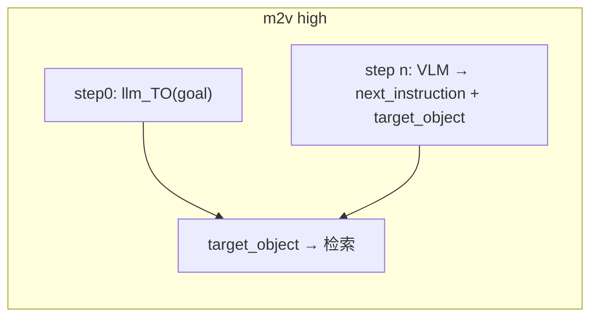

# Agents

本目录实现六种 VLM Agent：**m2**、**m2v**、**m12**、**TO**、**TOa**、**CPM**。实验入口在 `main.py`，通过 `AGENT` 切换；除 CPM 外接口统一为 `predict(annotated_screenshot_path, mode, **kwargs)`。

评测规则见 [eval/README.md](../eval/README.md)。

---

## 快速对比

| | **m2** | **m2v** | **m12** | **TO** | **TOa** | **CPM** |
|---|--------|---------|---------|--------|---------|---------|
| 模块 | `m2_agent.py` | `m2v_agent.py` | `m12_agent.py` | `TO_agent.py` | `TOa_agent.py` | `CPM_agent.py` |
| 输入图 | 标注图 top_k | 同 m2 | 同 m2 | top-1 `#` 框 | top-1 **建议框**（无 #） | **原图** |
| click 定位 | VLM `node_id` | 同 m2 | 同 m2 | **强制 top1** | **x,y 优先，否则 top1** | 归一化 `x,y` |
| step 评测 | `judge_m2` | 同 m2 | 同 m2 | `TO_top1`（`judge_top1_center`） | `TOa_coords` / `TOa_top1` | `judge_baseline` |

---

## AC-low vs AC-high（VLM 侧）

| | AC-low | AC-high |
|---|--------|---------|
| VLM 任务文本 | `goal` + 当前 step `instruction` | **仅** `goal` |
| `prev_step_instruction` | 上一步 GT instruction（wait 重复检测） | **不传** VLM |
| VLM 额外输出 | 无 | m2/m12：`next_instruction`；m2v 另有 `target_object` |
| 下一步 TO 输入 | 下一步 **GT** instruction | 上步 VLM `next_instruction`（缺则回退 goal） |
| m2v 下一步标注 | 同 m2 | 优先 `target_object` 检索，**跳过 llm_TO** |

high 模式下 VLM 不看到逐步 GT instruction，与 CPM 输入粒度一致；轨迹规划依赖 `next_instruction` / `target_object` 传递。

---

## 共同流水线（m2 / m2v / m12 / TO / TOa）

每步在 `main.py` 中：

```
解析 target_object → embedding 检索 top_k → 画标注图 → VLM.predict → 评测
         ↑
    llm_TO 或 TO_rank(best/mid/worst) 或 m2v target_object
```

**target_object 来源**（`TO_SELECT`）：

| `TO_SELECT` | 行为 |
|-------------|------|
| `generate` | 每步在线 `llm_TO(to_text)` |
| `best` / `mid` / `worst` | 从 `annotate/TO_rank/{stem}.json` 取预排序 TO_string；仅 **click/long_press** 步生效，其他类型仍 `generate` |
| （缺文件） | 回退 `generate` |

**共用组件**：

- **Prompt**：`prompts.py` — wait/navigate、**scroll 手势方向**、动态 step hint（low）
- **Scroll 后处理**：`scroll_gesture.py` — m2/m2v/m12/TO/TOa 在 `_normalize_action` 中对列表类 `scroll down` 做保守翻转
- **采样**：`temperature=0.1`, `top_p=0.3`（`LLM_QWEN_VL_MAX`）
- **解析 / 校验**：`parse_utils.py`、`action_validate.py`、`schema/ac_vlm_action.schema.json`
- **Token 统计**：`vlm_tokens.py`
- **无标注回退**：top1 bounds 无效或 nodes 为空 → 原图 + 归一化 `x,y`（走 baseline 评测）

---

## m2（`M2Agent`）

**定位**：标准「多候选 SoM 标注 + VLM 选 `node_id`」。

- **输入**：标注图（`#0,#1,...`）+ 任务文本（见上表 low/high）
- **输出**：`thought`, `action_type`，及 `node_id` / `direction` / `text` 等；high 另含 `next_instruction`
- **low**：`prev_step_instruction` 传入 prompt，用于 wait 重复指令启发
- **导出**：`_encode_image`、`_normalize_action` 供 TO / m12 复用

---

## m2v（`M2VAgent`）

**定位**：m2 + high 模式由 VLM **联合输出**下一步规划与检索目标。

与 m2 相同：low 全流程、`predict` 签名、SoM 评测。

**AC-high 差异**：

| 步骤 | 标注准备 |
|------|----------|
| step0 | `llm_TO(goal)` → 检索 |
| step n 完成后 | 用 `pred_action.target_object` 直接检索；缺失则回退 `llm_TO(next_instruction)` |

VLM high 额外字段 `target_object`（规则同 `annotate/llm_TO.py`：英文短标签、无方位词）。



---

## m12（`M12Agent`）

**定位**：m2 + 将 top-k 候选的 **文本语义表**注入 user prompt。

- **额外输入**：`annotate/topk_node_context.build_topk_candidate_table()` 生成的 Markdown 表（`#`、Label、Semantic、score）
- **Prompt**：`build_m12_prompt_parts` + `_m12_ac_rules_block`（强调对照表选 `node_id`）
- **`predict` 额外参数**：`stem`（建表）、`target_object`（写入表头）
- **评测**：与 m2 相同（`judge_m2`）

适合分析「检索 top-k 内选对 node」是否受语义表帮助。

---

## TO（`TOAgent`）

**定位**：检索与点击解耦 — VLM 只判 **action_type**，位置由检索 top-1 决定。

- **输入**：单框标注图 + `Retrieved target: "{target_object}"` + 任务文本
- **click / long_press**：VLM 不输出 `node_id`；`main.py` 写入 `top_k_nodes[0].node_id`
- **配置**：`AGENT="TO"` 且 `TOP_K=1`（`main.py` 校验）
- **评测**：step 用 top1 框中心 `judge_top1_center`（`TO_top1`）；另统计 **Retrieval Hit**（top_k 是否覆盖 `nearest_5`）

适合拆分「检索 miss」与「类型判错」。

---

## TOa（`TOaAgent`）

**定位**：TO + 可选 VLM 坐标 — 建议框仅作参考，检索不可靠时可自行打点。

- **标注**：`annotate_toa_step` → `toa_top_1/` 目录，仅半透明框、**无文字角标**、无 `#node_id`
- **VLM**：`build_toa_prompt_parts`；可选 `x,y`；禁止 VLM 输出 `node_id`
- **仲裁**（click/long_press）：
  1. 有效 `x,y` → `judge_baseline`（`locator_source=coords`）
  2. 否则 → 注入 top1 `node_id`（`locator_source=top1`）
- **低置信 prompt**（`τ_sim=0.50`，`τ_margin=0.04` 或 无标注）：提示可考虑坐标，**不强制**
- **配置**：`AGENT="TOa"`，`TOP_K=1`，`TO_SELECT` 与 TO 相同

---

## CPM（`CPMAgent`）

**定位**：对齐 test4.1.1 AgentCPM 协议，原图坐标 Agent（无 TO / 无 SoM）。

- **输入**：step **原图**（长边 ≤1120 resize，忽略标注图路径）+ CPM 中文 System
  - **low**：`<Question>{step instruction}</Question>`
  - **high**：`<Question>{goal}</Question>`
- **输出**：CPM JSON → `cpm_convert` 转为 AC `pred_action`（click 用 `x,y`）；`runs` 另存 `cpm_action`
- **main**：跳过 llm_TO、标注、TO_SELECT
- **评测**：`judge_baseline`；无 `retrieval_hit`
- **open_app**：GT 为 `open_app` 的步跳过，不调用 CPM

---

## 目录结构

| 文件 | 作用 |
|------|------|
| `m2_agent.py` | M2Agent；`_normalize_action`、`_encode_image` |
| `m2v_agent.py` | M2VAgent |
| `m12_agent.py` | M12Agent |
| `TO_agent.py` | TOAgent |
| `TOa_agent.py` | TOaAgent（建议框 + 可选坐标） |
| `CPM_agent.py` | CPMAgent |
| `cpm_prompts.py` / `cpm_convert.py` | CPM prompt 与 AC 转换 |
| `prompts.py` | 各 Agent 的 `build_*_prompt_parts`（含 `build_toa_prompt_parts`） |
| `scroll_gesture.py` | scroll 方向保守后处理（m2/m2v/m12/TO） |
| `parse_utils.py` | VLM JSON 解析 |
| `action_validate.py` | jsonschema + agent 规则（m2/m2v/m12 需 `node_id`；TO 禁止 pointer 字段） |
| `vlm_tokens.py` | VLM 调用与 token 计数 |
| `schema/ac_vlm_action.schema.json` | m2/m2v/m12/TO schema |
| `schema/cpm_action.schema.json` | CPM schema |

---

## 切换方式

`main.py` 顶部：

```python
AC_MODE = "low"       # 或 "high"
AGENT = "m2"          # m2 | m2v | m12 | TO | TOa | CPM
TOP_K = 5             # TO / TOa 时必须为 1
TO_SELECT = "generate"  # generate | best | mid | worst（CPM 无效）

TEST_START = 0
TEST_END = 50
TEST_LIST = []        # 非空时覆盖 START/END
MAX_STEPS = None      # 每 episode 最多步数
```

**结果文件**：

- m2 / m2v / m12 / TO / TOa：`runs/{AC_MODE}_{agent}_top{TOP_K}{to_select}_{vlm_model}.json`
- CPM：`runs/{AC_MODE}_CPM_{vlm_model}.json`

**离线评估**：

```bash
python eval/eval_run.py runs/low_m2_top5generate_qwen-vl-max.json
```

---

## 相关文档

| 文档 | 内容 |
|------|------|
| [eval/README.md](../eval/README.md) | Type/Step Acc、SR、scroll/wait 等特殊评测 |
| [README.md](../README.md) | 数据流、预处理、运行入口 |
| [AC_data/README.md](../AC_data/README.md) | 数据格式 |
