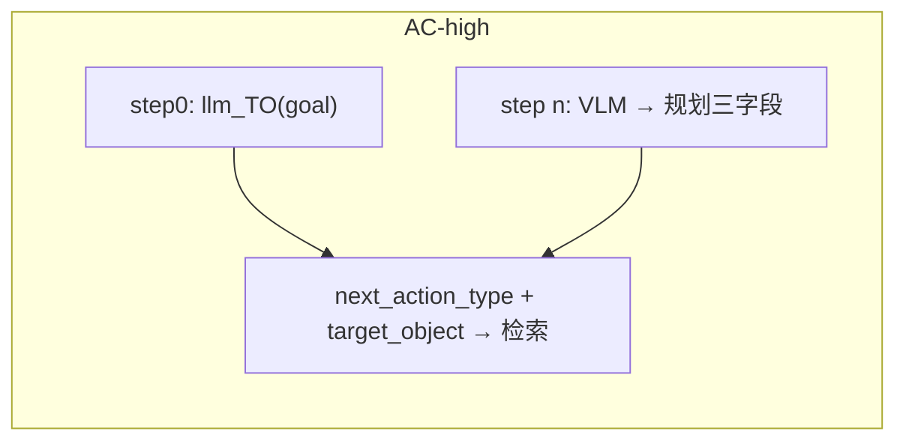

# Agents

本目录实现四种 VLM Agent：**m2**、**m2v**、**m12**、**TO**，以及无 SoM 的 **CPM**。实验入口在 `main.py`，通过 `AGENT` 切换；除 CPM 外接口统一为 `predict(annotated_screenshot_path, mode, **kwargs)`。

评测规则见 [eval/README.md](../eval/README.md)。

---

## 快速对比

| | **m2** | **m2v** | **m12** | **TO** | **CPM** |
|---|--------|---------|---------|--------|---------|
| 模块 | `m2_agent.py` | `m2v_agent.py` | `m12_agent.py` | `TO_agent.py` | `CPM_agent.py` |
| 输入图 | 标注图 top_k | 同 m2 | 同 m2 | top-1 `#` 框 | **原图** |
| click 定位 | VLM `node_id` | 同 m2 | 同 m2 | **强制 top1** | 归一化 `x,y` |
| step 评测 | `judge_m2` | 同 m2 | 同 m2 | `TO_top1`（`judge_top1_center`） | `judge_baseline` |

---

## AC-low vs AC-high（VLM 侧）

| | AC-low | AC-high |
|---|--------|---------|
| VLM 任务文本 | `goal` + 当前 step `instruction` | **仅** `goal` |
| `prev_step_instruction` | 上一步 GT instruction（wait 重复检测） | **不传** VLM |
| **本步 action_type 来源** | **llm_TO**（每步） | step0：**llm_TO**；step n>0：上步 VLM `next_action_type` |
| **VLM 输出（low）** | `thought` + 类型相关字段 | — |
| VLM 额外输出（high） | 无 | `next_instruction` + `target_object` + `next_action_type` |
| 检索 / 标注 | llm_TO 判为 pointer 时检索 | step0：llm_TO；step n+1：上步 VLM 规划 + pointer 门控 |
| 下一步 TO 输入 | 下一步 **GT** instruction | 上步 VLM `next_instruction`（缺则回退 goal） |

AC-low：`llm_TO` 负责 `action_type` + `target_object`；非 pointer 类型跳过检索，VLM 看原图并只填 action 字段。

AC-high：step0 临时调用 `llm_TO(goal)`；之后由上步 VLM 规划三字段驱动，**不再调用** `generate_retrieval_target`。

---

## 共同流水线（m2 / m2v / m12 / TO）

**AC-low** 每步：

```
llm_TO → action_type + target_object
  ├─ click/long_press → 检索 top_k → 标注图
  └─ 其他 → 原图（无 SoM）
→ VLM.predict(fixed_action_type=...) → 合并 pred_action → 评测
```

**AC-high** 每步：

```
step0: llm_TO(goal) → action_type + target_object → 条件检索
step n+1: 上步 VLM(next_action_type + target_object + next_instruction) → 条件检索
→ VLM.predict(fixed_action_type=...) + 输出下一步规划三字段 → 评测
```

**target_object 来源**（`TO_SELECT`）：

| `TO_SELECT` | 行为 |
|-------------|------|
| `generate` | AC-low：每步 `llm_TO`；AC-high：**仅 step0** `llm_TO(goal)` |
| `best` / `mid` / `worst` | **仅 step0** pointer GT 步覆盖 `target_object`（`action_type` 仍来自 llm_TO） |
| step n+1（high） | 上步 VLM `target_object`，不做 TO_rank 覆盖 |

**共用组件**：

- **Prompt**：`prompts.py` — wait/navigate、**scroll 手势方向**、动态 step hint（low）
- **Scroll 后处理**：`scroll_gesture.py` — m2/m2v/m12/TO 在 `_normalize_action` 中对列表类 `scroll down` 做保守翻转
- **采样**：`temperature=0.1`, `top_p=0.3`（`LLM_QWEN_VL_MAX`）
- **解析 / 校验**：`parse_utils.py`、`action_validate.py`、`schema/ac_vlm_action.schema.json`
- **Token 统计**：`vlm_tokens.py`
- **无标注回退**：top1 bounds 无效或 nodes 为空 → 原图 + 归一化 `x,y`（走 baseline 评测）

---

## m2（`M2Agent`）

**定位**：标准「多候选 SoM 标注 + VLM 选 `node_id`」。

- **输入**：标注图（`#0,#1,...`）+ 任务文本（见上表 low/high）
- **输出**：`thought`, `action_type`，及 `node_id` / `direction` / `text` 等；high 另含 `next_instruction`、`target_object`、`next_action_type`
- **low**：`prev_step_instruction` 传入 prompt，用于 wait 重复指令启发
- **scroll**：AC-low fixed 路径下 VLM **仅输出 direction**（区域由检索 top1 注入）；与 SMB 3.x m2 要求选框不同
- **导出**：`_encode_image`、`_normalize_action` 供 TO / m12 复用

---

## m2v（`M2VAgent`）

**定位**：m2 + high 模式由 VLM **联合输出**下一步规划三字段（与 m2/m12/TO 相同）。

与 m2 相同：low 全流程、`predict` 签名、SoM 评测。

**AC-high 差异**：

| 步骤 | 标注准备 |
|------|----------|
| step0 | `llm_TO(goal)` → `action_type` + `target_object` → 条件检索 |
| step n 完成后 | 上步 `next_action_type` + `target_object` + `next_instruction` → 条件检索（**无 llm_TO**） |

VLM high 额外字段：`next_instruction`、`target_object`、`next_action_type`。



---

## m12（`M12Agent`）

**定位**：m2 + 将 top-k 候选的 **文本语义表**注入 user prompt。

- **额外输入**：`annotate/topk_node_context.build_topk_candidate_table()` 生成的 Markdown 表（`#`、Label、Semantic、score）
- **Prompt**：`build_m12_prompt_parts` + `_m12_ac_rules_block`（强调对照表选 `node_id`）
- **`predict` 额外参数**：`stem`（建表）、`target_object`（写入表头）
- **评测**：与 m2 相同（`judge_m2`）

适合分析「检索 top-k 内选对 node」是否受语义表帮助。

---

## TO（`TOAgent`）

**定位**：检索与点击解耦 — VLM 只判 **action_type**，位置由检索 top-1 决定。

- **输入**：单框标注图 + `Retrieved target: "{target_object}"` + 任务文本
- **click / long_press**：VLM 不输出 `node_id`；`main.py` 写入 `top_k_nodes[0].node_id`
- **配置**：`AGENT="TO"` 且 `TOP_K=1`（`main.py` 校验）
- **评测**：step 用 top1 框中心 `judge_top1_center`（`TO_top1`）；另统计 **Retrieval Hit**（top_k 是否覆盖 `nearest_5`）

适合拆分「检索 miss」与「类型判错」。

---

## CPM（`CPMAgent`）

**定位**：对齐 test4.1.1 AgentCPM 协议，原图坐标 Agent（无 TO / 无 SoM）。

- **输入**：step **原图**（长边 ≤1120 resize，忽略标注图路径）+ CPM 中文 System
  - **low**：`<Question>{step instruction}</Question>`
  - **high**：`<Question>{goal}</Question>`
- **输出**：CPM JSON → `cpm_convert` 转为 AC `pred_action`（click 用 `x,y`）；`runs` 另存 `cpm_action`
- **main**：跳过 llm_TO、标注、TO_SELECT
- **评测**：`judge_baseline`；无 `retrieval_hit`
- **open_app**：GT 为 `open_app` 的步跳过，不调用 CPM

---

## 目录结构

| 文件 | 作用 |
|------|------|
| `m2_agent.py` | M2Agent；`_normalize_action`、`_encode_image` |
| `m2v_agent.py` | M2VAgent |
| `m12_agent.py` | M12Agent |
| `TO_agent.py` | TOAgent |
| `CPM_agent.py` | CPMAgent |
| `cpm_prompts.py` / `cpm_convert.py` | CPM prompt 与 AC 转换 |
| `prompts.py` | 各 Agent 的 `build_*_prompt_parts` |
| `scroll_gesture.py` | scroll 方向保守后处理（m2/m2v/m12/TO） |
| `parse_utils.py` | VLM JSON 解析 |
| `action_validate.py` | jsonschema + agent 规则（m2/m2v/m12 需 `node_id`；TO 禁止 pointer 字段） |
| `vlm_tokens.py` | VLM 调用与 token 计数 |
| `schema/ac_vlm_action.schema.json` | m2/m2v/m12/TO schema |
| `schema/cpm_action.schema.json` | CPM schema |

> **说明**：早期版本曾包含 `TOa_agent`（建议框 + 可选坐标），已移除；历史 `runs/low_TOa_*.json` 仍可用 `eval_run.py` 复评。

---

## 切换方式

`main.py` 顶部：

```python
AC_MODE = "low"       # 或 "high"
AGENT = "m2"          # m2 | m2v | m12 | TO | CPM
TOP_K = 5             # TO 时必须为 1
TO_SELECT = "generate"  # generate | best | mid | worst（CPM 无效）

TEST_START = 0
TEST_END = 50
TEST_LIST = []        # 非空时覆盖 START/END
MAX_STEPS = None      # 每 episode 最多步数
```

**结果文件**：

- m2 / m2v / m12 / TO：`runs/{AC_MODE}_{agent}_top{TOP_K}{to_select}_{vlm_model}.json`
- CPM：`runs/{AC_MODE}_CPM_{vlm_model}.json`

**离线评估**：

```bash
python eval/eval_run.py runs/low_m2_top5generate_qwen-vl-max.json
```

---

## 相关文档

| 文档 | 内容 |
|------|------|
| [eval/README.md](../eval/README.md) | Type/Step Acc、SR、scroll/wait 等特殊评测 |
| [README.md](../README.md) | 数据流、预处理、运行入口 |
| [AC_data/README.md](../AC_data/README.md) | 数据格式 |
