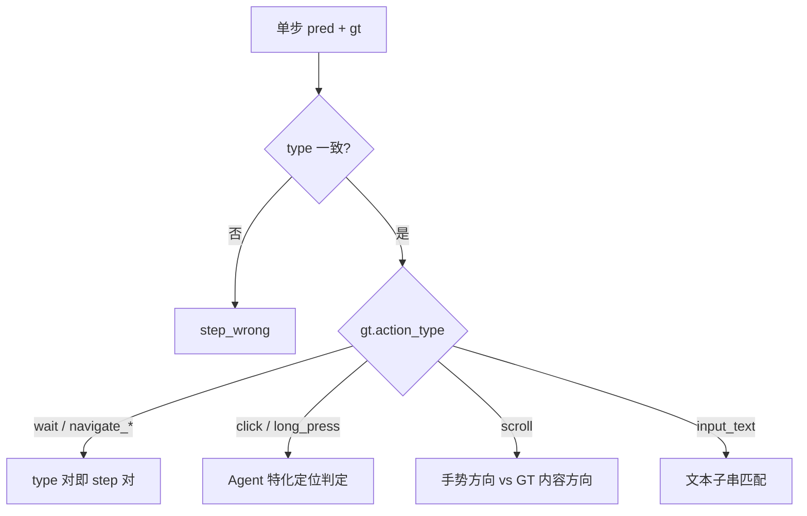

# 评测说明（eval/）

本目录实现 Android Control 实验的**逐步判定**与**批量汇总**。所有 Agent 共用同一套 `step_judge.py` 逻辑；差异主要体现在 click/long_press 的定位方式。

- 实验运行时：`main.py` 每步调用 `judge_step_match`，结果写入 `runs/*.json`
- 离线复评：`python eval/eval_run.py runs/<run>.json` → `eval/results/eval_<run>.json`
- 多 run 对比：`eval/compare_runs.py`、`对比.ipynb`

---

## 指标一览

| 指标 | 含义 |
|------|------|
| **Type Acc** | `pred.action_type == gt.action_type`（`long_click` 归一为 `long_press`） |
| **Step Acc** | Type 正确 **且** 该类型对应的字段判定通过 |
| **SR**（Success Rate） | 一个 episode 内**全部可评测步**的 step 均正确，该 episode 才算成功 |
| **Top-K Retrieval Hit** | 仅 click/long_press：检索 top_k 候选中**任一** `node_id ∈ gt.nearest_5` 即为 hit（与 VLM 是否选对无关） |

**可评测步**：`status != "skipped"`，且 GT 不是 `open_app`（与官方 AgentCPM 一致，open_app 步在 `main.py` 中跳过，不计入任何指标）。

---

## 判定流程



核心实现：`eval/step_judge.py`；几何判定：`eval/judge_llm.py`。

---

## 各 Agent 评测机制

所有 Agent 在 **scroll / input_text / wait / navigate_*** 上规则相同；**click / long_press** 因定位方式不同而分组。

### A. SoM 类：m2、m2p

| 项目 | 说明 |
|------|------|
| 预测定位 | VLM 输出 `node_id`（标注图上的 `#` 编号） |
| Step 判定 | `judge_m2(node_id, stem)` — pred 节点 **中心点**几何判定 |
| 命中条件（满足其一） | ① 中心点落在 `nearest_5` 任一 bbox 内<br>② 中心点与 GT `(x,y)` 归一化距离 **< 0.04** |
| Retrieval Hit | 统计 top_k 候选是否覆盖 `nearest_5` |

m2 与 m2p executor 的评测路径一致（`detail.mode` 均为 `m2`）。

无标注回退时（原图 + 归一化坐标），改走下方 CPM 的 baseline 路径。

### B. TO

| 项目 | 说明 |
|------|------|
| 预测定位 | VLM **不输出** `node_id`；系统以检索 **top1 框中心** 为点击位置 |
| Step 判定 | `judge_top1_center(top_k_nodes[0])` → 与 `judge_baseline` 相同几何规则（`TO_top1`） |
| 设计意图 | 解耦「检索是否命中」与「VLM 动作类型判断」 |

TO 要求 `TOP_K=1`。Retrieval Hit 仍按配置的 top_k 统计（通常为 1）。

### C. CPM

| 项目 | 说明 |
|------|------|
| 预测定位 | 原图 + 归一化 `x, y`（无 TO / 无 SoM） |
| Step 判定 | `judge_baseline(x, y, stem)` |
| 命中条件（满足其一） | ① 点击像素落在 `nearest_5` 任一 bbox 内<br>② 与 GT `(x,y)` 归一化距离 **< 0.04** |
| Retrieval Hit | **无**（不经过检索） |

---

## 按动作类型的 Step 规则

### click / long_press

SoM（m2/m2p/TO）与 CPM 使用同一套几何阈值，区别仅为点击位置来源：

| Agent | 点击位置 |
|-------|----------|
| CPM | VLM 输出的归一化 `(x,y)` → `judge_baseline` |
| m2 / m2p | pred 节点 bbox **中心** → `judge_m2` |
| TO | 检索 **top1** 框中心 → `judge_top1_center` |

距离阈值 `DISTANCE_THRESHOLD = 0.04`（`eval/judge_llm.py`）。

### scroll（特殊）

AC GT 的 `direction` 表示**屏幕内容移动方向**；模型应输出**手指滑动手势方向**，二者上下左右相反（对齐官方 `process_ac.py` 的 `map_direction`）。

| GT 内容方向 | 期望模型输出（手势） |
|-------------|---------------------|
| down | up |
| up | down |
| left | right |
| right | left |

实现：`eval/scroll_direction.py` → `scroll_gesture_matches_gt(pred, gt)`。  
Step 正确 ⟺ `pred.direction == map_ac_content_to_gesture(gt.direction)`。

> 注意：step instruction 里的「scroll down」有时是内容语义、有时是手势语义，与 GT 不一定字面一致。推理侧（m2/m2p/TO）另有 prompt 与保守后处理，见 `agents/scroll_gesture.py`。

### input_text

Type 正确后，比较 `pred.text` 与 `gt.text`：

- 转小写、strip
- **互为子串**即算对（对齐 AgentCPM 官方 EM）

### wait / navigate_back / navigate_home（特殊）

**Type 正确即 Step 正确**，不再检查坐标、方向或文本。

评测不关心 VLM 是否误点了 SoM 框——只要求 `action_type` 对。这与 prompt 中「wait 不要 click」的规则相配合，但评测本身只看类型。

---

## 目录与入口

| 文件 | 作用 |
|------|------|
| `step_judge.py` | 单步 type/step 判定、retrieval hit、可评测步过滤 |
| `judge_llm.py` | `judge_m2`（pred 节点中心）、`judge_top1_center`（检索 top1 中心）、`judge_baseline`（x,y 点） |
| `scroll_direction.py` | GT 内容方向 ↔ 手势方向映射 |
| `eval_run.py` | 读取 `runs/*.json`，输出汇总与逐步明细 |
| `compare_runs.py` | 扫描 `runs/`，对比多实验 |
| `run_naming.py` | 从文件名解析 `ac_mode` / `agent` / `top_k` / `vlm_model` |
| `results/` | `eval_run.py` 默认输出目录 |

### 命令示例

```bash
# 单 run 评估
python eval/eval_run.py runs/low_m2_top5generate_qwen-vl-max.json

# TO 示例（TOP_K=1）
python eval/eval_run.py runs/low_TO_top1best_qwen-vl-max.json

# 输出示例字段
# type_acc, step_acc, by_action_type, retrieval_hit_rate
```

`runs/*.json` 中若已含 `type_correct` / `step_correct`（`main.py` 在线写入），`eval_run.py` 会优先复用，避免重复计算。

---

## 与 Agent 文档的关系

- Agent 能力、prompt、推理差异：[agents/README.md](../agents/README.md)
- 数据与预处理：[AC_data/README.md](../AC_data/README.md)
- 实验入口与运行方式：[README.md](../README.md)
